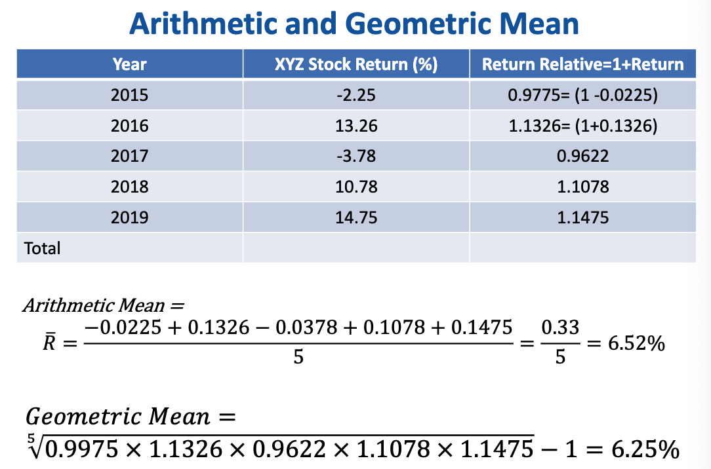
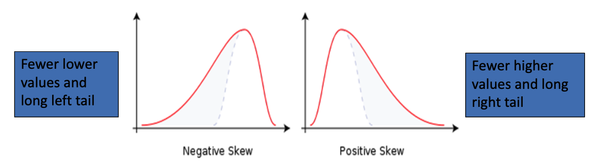
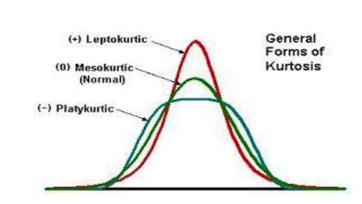

# Risk and Return

## Return

### Total return 

> Example: 100 shares of XYZ company are purchased at \$32 and sold one year later at \$28 per share. A dividend of \$2 per share is paid
> $$
> \mathit{TR}_e=\dfrac{[28+2]-32}{32}=\dfrac{28+2}{32}-1=-6.26\%
> $$
> 

### Return Relative

**Return Relative** (RR): The total return for an investment for a given period stated on the basis of 1.0. 
$$
\mathit{RR}_e=\dfrac{P_t+\mathit{Div}_t}{P_{t-1}}=1-R
$$

> **Example**: **100 shares** of XYZ company are **purchased** at **\$32** and **sold** one year later at **\$28 per share**. A **dividend of \$2** per share is paid
> $$
> \mathit{RR}_e=\dfrac{28+2}{32}=0.9375
> $$

When calculating the geometric mean the negative return cannot be used. The return relative solve the problem.

### Arithmetic Mean/Average

Arithmetic Mean/Average measures the average performance. It is an expected return for next period
$$
\overline{R}=\dfrac{\sum_{i=1}^T R_i}{T}
$$
**No reinvestment of income**

> Example: 
>
> **(If no reinvestment)**
>
> Deposit \$1,000
>
> Interest rate 10%
>
> - First year: $\$1,000 \times 0.10 = \$100\quad \text{(withdraw this amount)}$
> - Second year: $\$1,000 \times 0.10 = \$100\quad \text{(withdraw this amount)}$
> - ...
>
> **(not withdraw / reinvestment the interest)**
>
> Deposit \$1,000
>
> Interest rate 10%
>
> - First year: $\$1,000 \times 0.10 = \$100\quad \text{(do not withdraw this amount)}$
> - Second year: $\$1,100 \times 0.10 = \$110\quad \text{(do not withdraw this amount)}$
> - Third year: $\$1,210 \times 0.10 = \$121\quad \text{(do not withdraw this amount)}$

### Geometric Mean

- The compound rate of return over time. Measures the change in wealth overtime
- It shows how the money grows ==over a specific period==
- It is often used in investments and finance to ====reflect the steady growth rate of== invested funds over some past period

$$
\overline{\mathit{RR}_e}=\sqrt[n]{\prod^n_t\mathit{RR}_t}-1\\[2ex]
\overline R=1-\overline{\mathit{RR}_e}
$$

- The geometric mean is defined as the nth root of the product resulting from multiplying a series of return relatives together
- Calculators with the power functions can be used to calculate the roots
- An alternative method of calculating the geometric mean is to ==find the log of each return relative==, sum them, divide by n, and taking the antilog

> Example 
>
> 

- Note that **geometric** average rate of return is always ==lower== than the **arithmetic** average return because it reflects the ==variability== of the returns
- The spread between the two depends on the dispersion of the distribution
- The greater the dispersion`分散`, the greater the spread between the two means

### Cumulative Wealth Index

Cumulative wealth over time, given an initial wealth and a series of returns on some asset
$$
\mathit{CWI}_n=\mathit{WI}_0
\times\mathit{RR}_1
\times\mathit{RR}_2
\times\cdots
\times\mathit{RR}_n
$$
Where: 

- $\mathit{CWI}_n$: the cumulative wealth index as of the end of the period n
- $\mathit{WI}_0$: the beginning index value, typically $1

> Follow the last Example
>
> $\mathit{CWI}_{2019}= 1.00(0.9975)(1.1326)(0.9622)(1.1078)(1.1475)=1.35$
>
> \$10,000 invested at the end of 2014 (the beginning of 2015) would have been worth $13,500 by the end of 2019. 

### Inflation-Adjusted Cumulative Wealth Index

Inflation-adjusted cumulative wealth
$$
\mathit{CWI}_{IA}=\mathit{CWI}/\mathit{CIINF}
$$

- $\mathit{CWI}_{1A}$: the cumulative wealth index value for any asset on inflation-adjusted basis
- $\mathit{CWI}$: the cumulative wealth index for any asset on a nominal basis.
- $\mathit{CIINF}$: the ending index value for inflation, calculated as $(1+\textrm{geometric rate of inflation})^n$, where n is the number of period considered. 

## Volatility and risk 

### Expectations 

Expected returns are based on the probabilities of possible outcomes –forward looking
$$
E(R)=\sum^n_{i=1}p_iR_i
$$

> Example
>
> A game of chance has 50% probability of paying \$5 and 50% probability of paying $7
>
> The expected return is: 0.5 x 5 + 0.5 x 7 = $6

In this context, “expected” means average if the process is repeated many times

### Volatility

- A statistical measure of dispersion (of returns)
- Tells us how spread out a random variable is around the mean.
- High volatility usually means high risk

#### Variance

$$
\sigma^2=\dfrac{\sum_{t=1}^n(R_t-\overline R)^2}{n-1}
$$

In Excel: `=var.s(cell range for returns)`

#### Standard Deviation

$$
\sigma=\sqrt{\dfrac{\sum_{t=1}^n(R_t-\overline R)^2}{n-1}}
$$

In Excel: `=stdev.s(cell range for returns)`

## Skewness & Kurtosis

### Skewness

- Tells us how symmetrical the distribution is around the mean
- A random variable is ==symmetric== around the mean will have ==zero skewness==

1. With a ==negatively skewed== distribution, there is ==greater downside risk== than what the standard deviation measures.
2. ==Less down side risk than indicated by the standard deviation== when the distribution ==positively== skewed

#### The coefficient of skewness

- Positive Skewness: The distribution has a long tail to the right. 
  	Mean Return > Median Return > Mode`众数`

- Negative Skewness: The distribution has a long tail to the left.

  ​	Mean Return < Median Return < Mode

- Symmetrical Distribution

  ​	Mean = Median = mode

### Kurtosis

#### Test for Normality

A simple way to test for normality is to compare the computed skewness  and kurtosis coefficients with the theoretical values under the assumption of normality; namely 0 and 0 respectively

- Skewness = 0
- Kurtosis = 0

## Dollar Standard Deviation

- Begin by calculating return standard deviation (percentage)
- Multiply this value by the current dollar value of the security

## Annualization

Calculate **annualized return** from:

- $\textit{Daily returns} = (1+ \textit{Daily average return})^{365} - 1$
- $\textit{Weekly returns} = (1+ \textit{Weekly average return})^{52} - 1$
- $\textit{Monthly returns} = (1+ \textit{Monthly average return})^{12} - 1$

Calculate **annualized standard deviation (SD)** of returns from

- $\textit{Annualized SD by Daily SD} = (\textit{Daily SD} \times 365)^.5$
- $\textit{Annualized SD by Weekly SD} = (\textit{Weekly SD}\times52)^.5$
- $\textit{Annualized SD by Monthly SD}= (\textit{Monthly SD}\times12)^.5$