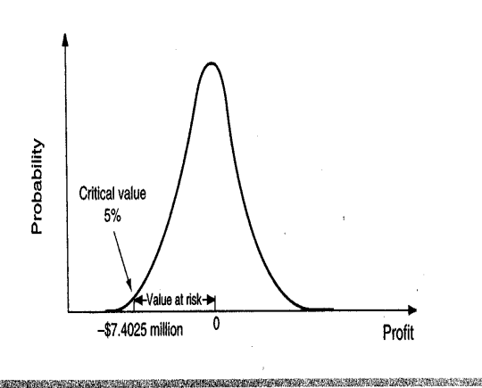
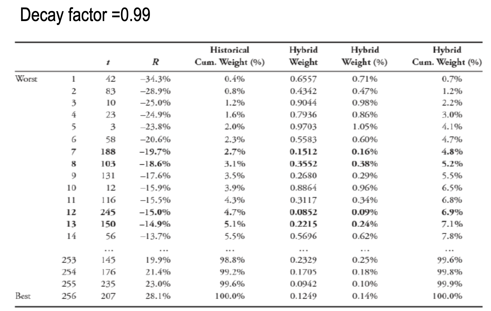

# Session 3 Market Value - Value at Risk (VaR)

## Learning Objects

- Value at Risk (VaR) 
- VaR Parameters
- Parametric and non-parametric VaR
  - Parametric approach (Delta normal)
  - Non-parametric approach (Historical and hybrid) 

## Value at Risk (VaR) 

It is defined as the ==**worst loss**== that is possible **under normal market condition** **during a given time period**. 

> 是损失值，而非资产扣除风险后的价值（与保险课程内容不同）
>
> 实际上就是损失在置信区间内的最大期望值（95%情况下的最大损失）

Measure of downside risk

- Example: One day 95% VaR of the portfolio is \$7.4025
- Interpretation: In a day, the portfolio is ==**expected to lose**== \$7.4025 or **==less== in 95%** of the scenarios and lose more than $7.4025 in 5% of the scenarios. 

## VaR Calculation and Normal Distribution

****

## VaR: Parameters

To measure VaR, we need to define two quantitative parameters; 

1. The confidence level 
2. The horizon`水平、地平线`

### Loss and Tolerance Level (or Confidence Level)

- The ==higher the confidence level== *c*, the ==greater the VaR== measure.
- We can make a statement such as:
  - The maximum loss over one day is about $47 million at the 95 percent confidence interval. 
- The problem is that as ‘*c*’ increases, the number of occurrences become extremely high leading to poor measures of large but unlikely losses.
- The VaR number is usually used to decide how much capital to set aside to avoid bankruptcy.
- In this situation high confidence level is advisable. 
- The usual recommendation is to pick a confidence level that is not too high, i.e. 95 to 99. 

### Horizon

- The longer the horizon(*T*), the greater the VaR measure. 
- How to extrapolate`推断` from a one-day horizon to a longer horizon, 
  - we need to assume that returns are independently and identically distributed.

$$
\mathit{VaR}_\text{(T days)}=\mathit{VaR}_\textrm{(1 Days)}\times\sqrt T
$$

> **Question**: one day VaR $7.4 million What is the annual VaR? 
> $$
> -7.4\times365^.5 = - 141.38\textrm{ million}
> $$

## Calculating Value at Risk (VaR)

VaR can be computed for a: 

1. Firm
2. Portfolio 

3 Method to Calculate Var

1. Monte Carlo Simulation Approach Simulates Multiple Random Scenario   
2. Nonparametric Approach 
   - No assumption about the shape of the distribution
   - E.g. Historical Approach
3. Parametric Approach
   - The distribution is normal
   - E.g. Delta-normal Approach

### Parametric Approach

Computing Value at Risk from Return

- Computing value at risk is straightforward when the returns are normally distributed

If x is a normally distributed random variable
$$
z=(x-\mu)/\sigma
$$
follows the standard normal distribution because it has mean zero and volatility equal to one

At the 5% level: 
$$
\begin{align}
&-1.65=(x-\mu)/\sigma\\[1ex]
\Rightarrow \qquad &x=-1.65\sigma+\mu\\[1ex]
\Rightarrow \qquad&\mathit{VaR}=-1.65\sigma+\mu

\end{align}
$$
When the returns are normally distributed, μ is 0 and therefore it is ignored. 

Excel function to calculate `z = norminv(p,0,1)`

> **Example**
>
> Estimated standard deviation of daily returns for Banana Corp’s stock is 4% ($\sigma=0.04$). Calculate the one day 95% VaR for the stock returns
>
> **Answer**
> $$
> -1.645\times0.04=-0.0658
> $$
> Interpretation: Probability of a loss greater than 0.0658 is 5% Probability of a loss less than 0.0658 is 95% 

#### Calculation with Portfolio Value

If the portfolio return is normally distributed, and has volatility (sigma) over the measurement period, the VaR of the portfolio for 95% confidence level is: 
$$
\mathit{VaR}_P=1.645\times\sigma_P\times \textrm{Value of portfolio}
$$

> **Example**
>
> Suppose that \$15 million is invested in shares of company A and \$10 million in company B. 
>
> Returns of company A have a standard deviation of is 30 percent per annum and those of company B have a standard deviation of is 20 percent per annum. 
>
> Returns follow a normal probability distribution. 
>
> **Answer**
>
> Extreme market conditions are expected 5% of the time. Therefore, confidence interval (C) = 0.95. 
>
> The value at risk (==VaR==) of the investment in A is therefore, 
> $$
> \textit{VaR} = [1.645 \times 0.3]\times15m = 7.4025 \textrm{ Million}
> $$
> Value at Risk (VaR) of company B
> $$
> \textit{VaR} = [1.645 \times.2]\times$10=  3.29 \textrm{ Million}
> $$
> The ==correlation== between the return on the shares is 0.65
>
> **Calculate the value at risk (VaR) of the portfolio.**
>
> Due to benefits of portfolios, Var is less than the total of individual VaRs when the correlation between returns is less than 1. 
> $$
> \begin{align}
> \mathit{VaR}_P&=\sqrt{\mathit{VaR}_1^2+\mathit{VaR}^2_2+2\times\rho_{1,2}\times\mathit{VaR}_1\times\mathit{VaR}_2}\\[2ex]
> &=\sqrt{7.4025^2+3.29^2+2\times0.65\times7.4025\times3.29}\\[2ex]
> &=9,8631\textrm{ Million}
> \end{align}
> $$
> This value is less than the total of VaRs of the A and B which is \$7.4025 million +\$3,29 million = $10.6925 million

### Nonparametric VaR

- Nonparametric VaR is derived from a distribution that is constructed using historical data
- Calculating nonparametric VaR, unlike the parametric approach, does not involve estimating the parameters of a theoretical distribution

#### Calculating the Nonparametric VaR involves

1. Calculate the ==return== on the asset or Portfolio
2. Assuming that the confidence interval c, is 95%, calculate the ==5th percentile`百分位数` of this distribution== 
3. VaR is the distance of the 5th percentile from the distribution.

**For example**: 

Calculating one-day 95% VaR using 100 days of return data.

- 95th percentile will be the 5th worst day (return).

Calculating one-day 95% VaR using 256 days of return data

- 95th percentile will be the return/loss on 12.8th worst day.. 12th or 13th?
  - A conservative`保守` approach is to select the 12th worst day. `向下取整`

#### Percentile Calculation

1. Calculate the return
2. Arrange the returns from the smallest to the largest

-50%, -48%, -45%, -42%, -39%, -36%, -35%, -33%, -30%, -29%, -27%, -24%, -22%, -19%, -18%, -15%, -13%, -11%, -9%.

- 5th Percentile using the formula： 
  - $L_p=(n+1)\dfrac P{100}$
  - Here, $L_p=(19+1)\dfrac 5{100}=1$
- The 5th percentile is the worst day (1) = -50%

#### EXCEL STEPS

Step1: = Calculate returns

Step2: = Use the function `PERCENTILE.EXC(array, 0.05)` for 95% CI or 5th Percentile.

### Hybrid VaR

- The main **weakness** of historical model of VaR is that it ==assigns equal weights== to each data point
- If the risk has increased recently, the historical model is likely to underestimate the current risk
- To overcome this weakness, the hybrid VaR assigns ==higher weights to more recent data points== and lower weights to more distant data points
- The weights are assigned using a ==decay factor==, 
  - For example, if our decay factor is 0.99 the most recent data point is assigned 1, the second most recent factor is assigned a weight of $0.99$, the third most recent factor is assigned a weight of $0.99^2$ and so on.

> 下表：
>
> - Historical weiget: return的百分比分位数加总，rank/256*100%
> - Hybrid Weight: $0.99^{(256-t)}$
> - Hybrid Weight (%): $\dfrac{0.99^{(256-t)}}{\sum_{t=1}^{256}0.99^{256-t}}$

- According to the above table, 5% of the total weight is between seventh and eighth rows. 
- If we want to be conservative, we can take worst of these two points or we can interpolate between them. 
- If we choose to be conservative, our one day 95% VaR with a decay factor of 0.99 would be 19.7%. 