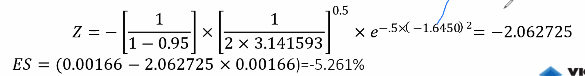
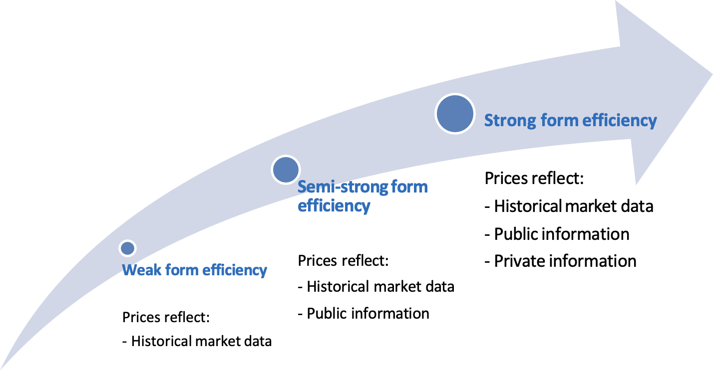
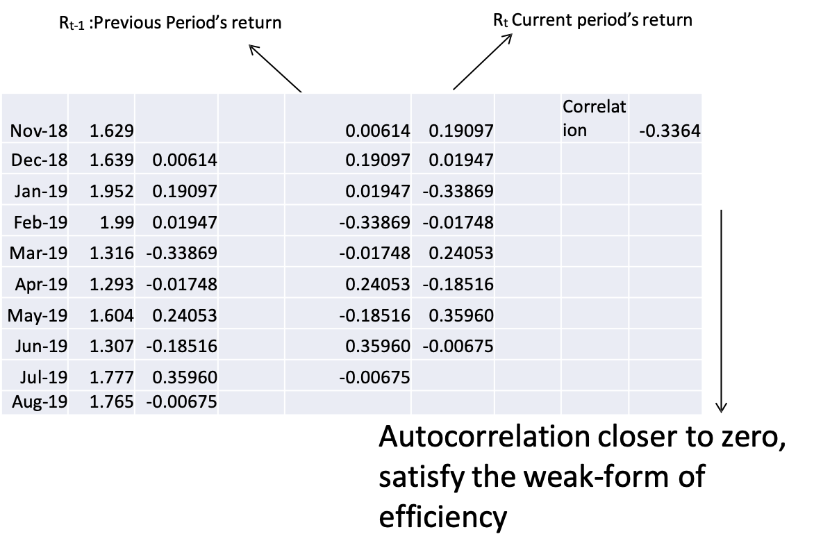

# Session 4: Market Risk and Market Efficiency

Expected shortfall risk (tail risk measure)

Efficient market hypothesis

- Market efficiency

- Types of market efficiency

- Factors affecting market efficiency

- Efficient market hypothesis

- BEO3000 Risk Management Models

## Properties of the risk measures

- According to Artzner et al. (1999)

- Monotonicity: if a portfolio achieves higher returns than another in every state of the world, then it will have a lower risk.

- Translation invariance: if an amount of cash is added to our portfolio, the risk will be reduced by that amount.

- Homogeneity: maintaining the weights, if the size of a portfolio is increased by a factor, the risk will be multiplied by the same factor.

- Subadditivity: the risk measure of two merged portfolios should be lower than the sum of their risk measures individually.

## Expected Shortfall?

==**Expected Shortfall**== is defined as the **==average of all losses which are greater than VaR==**, i.e. the average loss in the worst (1-C)% cases, where C is the confidence level. Said differently, it gives the expected value of an investment in the worst q% of the cases.

- VaR does not tell us anything about the tail of the distribution.

- Two portfolios could have the same VaR but very different distribution beyond 95% CI.

- The ==expected loss under **extreme** circumstances or events== is the ‘**==expected shortfall==**’$ES$.

- Also called ‘==**conditional VaR**==’($\mathit{CVaR}$)

See [Investopedia](https://www.investopedia.com/terms/c/conditional_value_at_risk.asp)

**Example**

The following are 12 worst percentage returns out of 1000 daily returns for a share. 17,14,14,13,13,12,12,12,12,11,11,11

- What is the one day 99% VaR?
- This should correspond to the 10th worst loss.
- What is the one day 99% expected shortfall?
- This is the average of the 10 worst losses.

### Expected shortfall - Excel

Step 1: Estimate return

Step 2: Estimate VaR following the non-the parametric approach =PERCENTILE.EXC(range, 0.05)

Step 3: Use  *averageif* function to get the average of the all returns after the value at risk

=AVERAGEIF( Return Range , “<“ and  VaR(Non-parametric) ,  Return Range

Example:

=AVERAGEIF( F3:F254  ,"<"&F277 , F3:F254 )

### Formula

Parametric approach
$$
ES = (\mu+Z\sigma)
$$
Where
$$
Z = -\left[\dfrac1{1-c}\right]\cdot \left[\dfrac1{2\pi}\right]^{0.5}\cdot e^{-0.5z^2}
$$

- $c$: confident level
- $\mu$: mean return
- $\sigma$: standard deviation of return
- $z$: z-value for selecterd confident level

Example: 

---

Or 
$$
\mathit{CVaR}=\dfrac1{1-c}\int_{-1}^{\mathit{VaR}}xp(x)\mathrm{d}x
$$
where: 

- $xp(x)$: the probability density of getting a return with value “$x$”
- $c$: the cut-off point on the distribution where the analyst sets the VaR breakpoint
- $\mathit{VaR}$: the agreed-upon VaR level `可以用95%分割点估计值`

## Efficient Market Hypothesis

### Market Efficiency

- The extent to which market **prices incorporate available information**.

- If prices do not fully incorporate information, opportunities exist to earn abnormal profits.

### Efficient Market Hypothesis

When new information comes into the market, it is immediately and accurately reflected in the stock prices.

- Shares always trade at the fair price, i.e. market value = intrinsic value

- So, it is impossible to purchase undervalued or sell overvalued shares

### Forms of market efficiency

### Weak-form efficiency

Security prices fully reflect all past market data (price and volume).

- Historical trading data will already be reflected (discounted) in current prices and should be of no value in predicting future price changes.

- Technical analysis that relies on the past history of price information is of little or no value.

**Weak-form evidence**

- Check the pattern`模式` of prices
- If prices and ==returns are serially correlated==, the market is not weak form efficient.

Why?

- If price changes are dependent, the future changes can be predicted

#### Simple test of Weak-Form Efficiency using EXCEL

### Testing the Statistical Significance of Auto-correlation

We can use the t-test to test the statistical significance of the auto-correlation coefficient as follows:

$$
t=r\cdot\dfrac{\sqrt{n-2}}{\sqrt{1-r^2}}
$$
Where $r$: correlation

In the above example, auto-correlation coefficient for lag 1 is $-0.3689$. To get this figure we have used 15 returns out of 16. Therefore, the t statistic is calculated as follows:
$$
t=-0.3689\times(15-2)^.5/(1-(-0.3689^2)^.5	= -1.4308
$$
Calculate the p-value for the above t-value and compare it with the chosen level of significance (1% or 5%)

Excel function to calculate p-value for the t-value calculated is as follows:

 `=T.DIST.2T(ABS(t),n-2)` 

Where n is the number of returns used to calculate the t-value

For the above example, p-value is computed as follows:

`=T.DIST.2T(ABS(-1.485),15-2) = 0.1760`

If the level of significance is 5%, we need to compare this with the calculated p-value. If the calculated p-value is less than the level of significance, market is weak for efficient as there is a significance correlation of the current return and previous return (lag 1).

