# Session 5 Portfolios theory: An introduction

## Learning Objects

- Covariance 
- Correlation 
- Portfolio theory 
- Portfolio return and risk
- Diversification benefit 
- Univariate regression 

## Variance and Covariance
- **VARIANCE** measures the degree of ==deviation from  the mean== of one variable.  `变量波动，距离平均值的距离`
- **COVARIANCE** measures the degree of ==association== between two variables. `两个变量共同运动的程度`
- Variance is a special case of covariance – variance is the covariance of a variable with itself. 

### A Variance – Covariance Matrix 
- It is a square matrix that contains the variances and  covariances associated with each pair of investments in a  portfolio. 
- The covariance coefficients could be either negative or  positive depending on the assets characteristics.

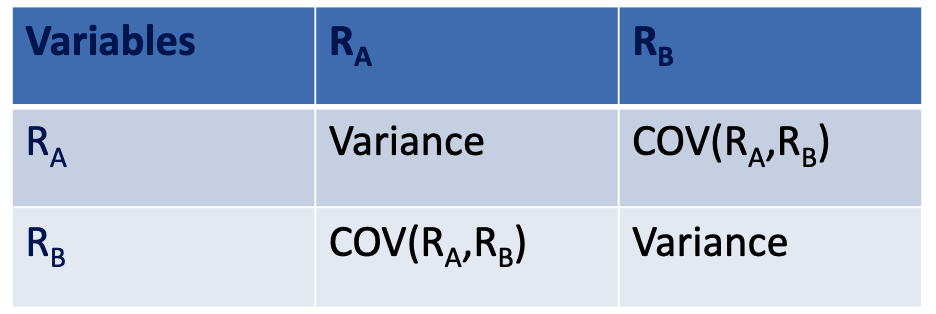 

### Calculating Covariance

We can use the following formula to calculate the covariance between two variables if means of both variables are unknown: 
$$
\mathit{COV}(R_i, R_j)=\dfrac{\sum_{t=1}^{n}(R_{i,t}-\overline{R}_i)(R_{j,t}-\overline{R}_j)}{n-1}
$$
Where: 

- $R_{i,t}$: the return on security $i$ during interval $t$
- $R_{i,j}$: the return on security $j$ during interval $t$
- $\overline{R}_i$ : expected return on security $i$
- $\overline{R}_j$: expected return on security $j$
- $n$ : the number of observations

## Correlation

- Correlation is closely related to the concept of covariance. 
- The correlation coefficient `相关系数` measures the degree of association between two variables (investment). 
- The correlation coefficient can ==range from -1.0 (perfect negative)==, meaning two variables move in perfectly opposite directions ==to +1.0 (perfect positive)==, which means the two assets move exactly together. 
- A correlation coefficient of 0 means that there is no relationship between the returns earned by the two assets. 

> 协方差不具有可比性，相关系数是标准化的协方差

### Calculating Correlation

Correlation coefficient can be calculated as:
$$
\rho_{XY}=\dfrac{\sigma{_{XY}}}{\sigma_X\sigma_Y}
$$
Where: 

- $\rho_{XY}$: Covariance between X and Y 
- $\sigma_X$: Standard deviation of X
- $\sigma_Y$: Standard deviation of Y

Beware: Correlation does not prove causation`因果`!

## Portfolio Return

To calculate a **portfolio’s expected rate of return**, *weight* each individual investment’s expected rate of return using the fraction of the portfolio that is invested in each investment. 
$$
E(R_p)=\sum_i w_iE(R_i)
$$

### **An **Example

If you invest 49% of your money in the stock A with an expected rate of return of 1.1% and 51% your money in the stock B with an expected rate of return of 1.6%, what will be the expected rate of return on this portfolio? 

Solution: 
$$
\begin{align}

Rp &= W_A \cdot R_A+W_B\cdot R_B \\
&= 0.49\times(0.011) + 0.51 \times(0.016) \\
&= 0.0136 \\
&= 1.36\%  \\

\end{align}
$$

## Portfolio Risk 

Risk of the portfolio is measured by ==standard deviation ($\sigma_p$)== or variance of the portfolio. 

- The standard deviation of the return on the portfolio ($\sigma_p$) is ***not*** simply a weighted average of the standard deviations of the securities in the portfolio. 

- This is because the riskiness of a portfolio depends not only on the riskiness of the individual securities but also on the relationship between the returns on those securities. 

### Calculating Portfolio Risk

We can calculate the variance of a portfolio consisting of investment in 1 and 2 as: 
$$
\sigma_p=\sqrt{w_1^2\sigma_1^2+w_2^2\sigma_2^2+2w_1w_2\rho_{1,2}\sigma_1\sigma_2}
$$
where: 

- $\rho_p$: the standard deviation of portfolio
- $w_i$: the proportion of the portfolio invested in asset $i$
- $\rho_i$: the standard deviation in the rate of return earned by asset $i$
- $\rho_{i,j}$: the correlation coefficient between the rates of return earned by asset $i$ and $j$

### Portfolio – Diversification Benefit

- The effect of reducing risks by including a large number of investments in a portfolio is called **diversification**. 

- As a consequence of **diversification**, the standard deviation of the returns of a portfolio is typically ==less than== the average of the standard deviation of the returns of each of the individual investments. 

- The diversification gains achieved by adding more investments will depend on the degree of correlation among the investments. 

#### Diversification: An Example

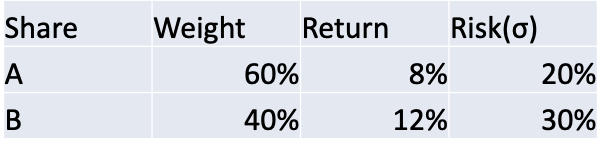
$$
\rho_P^2=0.6^2\times0.2^2 + 0.4^2\times0.3^2 + 2\times0.6\times0.4\timesρ_{12} (0.2)(0.3)\\[1ex]
\rho_P=\sqrt{0.0228+0.0228\rho_{12}}
$$
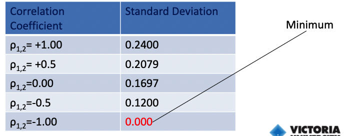

### Optimal Weight

#### Weights for Minimum Variance Portfolio

$$
w_1=\dfrac{\sigma_2^2-\sigma_{12}}{\sigma_1^2+\sigma_2^2-2\sigma_{12}}\\[2ex]
w_2=1-w_1
$$

#### Weights for Maximum Sharpe Ratio

Sharpe Ratio: 
$$
\textit{Sharpe Ratio}_i=\dfrac{r_i-r_f}{\sigma_i}
$$

$$
let\qquad R_i=r_i-r_f
$$

Where:  

- $r_f$: risk free rate

$$
w_1=\dfrac{
R_1\sigma_2^2-R_2\sigma_{12}
}{
R_1\sigma_2^2+R_2\sigma_1^2-(R_1+R_2)\sigma_{12}
}\\
w_2=1-w_1
$$

#### Example

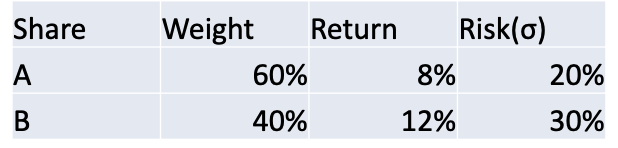
$$
w_A=\dfrac{\sigma_2^2-\sigma_{12}}{\sigma_1^2+\sigma_2^2-2\sigma_{12}}=0.8571\\[1ex]
w_B=1-w_A=0.1429
$$

## Three-Asset Portfolio Example

The following table gives information on three assets A, B and C.
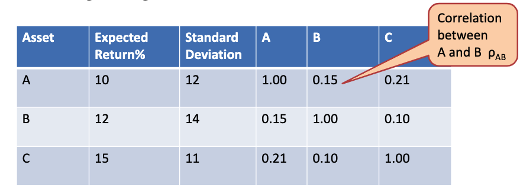
Portfolio 1 consists of 40% asset A, 30% of asset B and of 30% asset C.
Calculate its expected return and the portfolio risk.

**Answer**

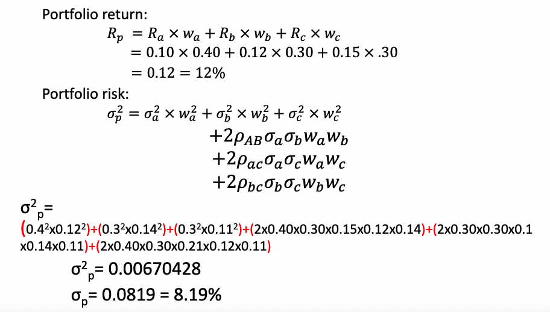

## Risk and Return of Potential Portfolio Mixes of Investments a Share and a bond

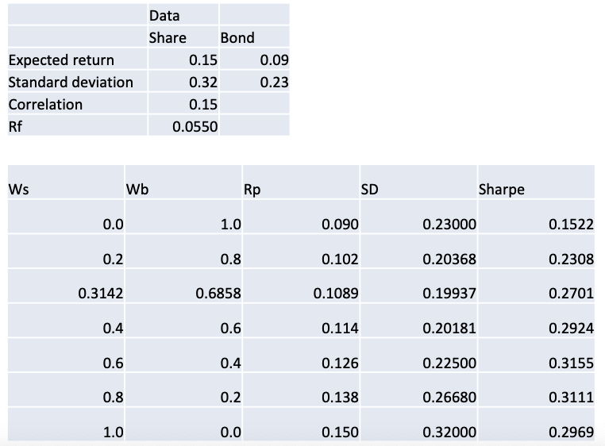

Weights for minimum variance portfolio:  

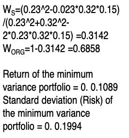

Note: If one of the securities has a negative correlation, even though their correlation is low, we need to search for the next pair of securities whose correlation is low to combine them into a portfolio

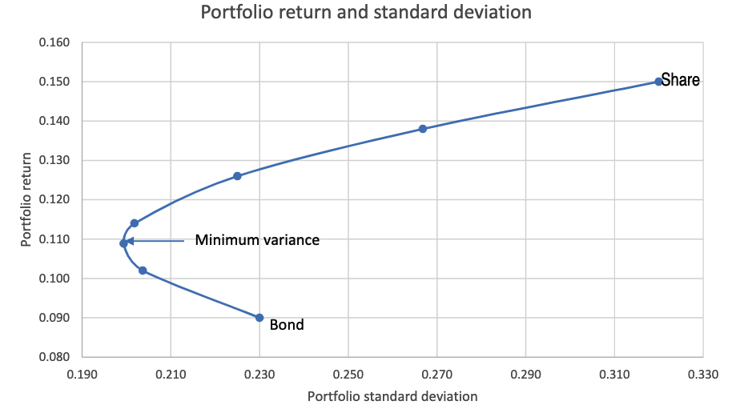

The above curve is known as the efficient frontier or investment opportunity set.

### Combined Portfolio

Weights for to maximise the Sharpe ratio
$$
w_S=\dfrac{R_S\sigma_B-R_B\sigma_{SB}}{R_S\sigma^2_B+R_B\sigma_S^2-(R_S+R_B)\sigma_{BS}}\\[1ex]
w_B=1-w_s
$$

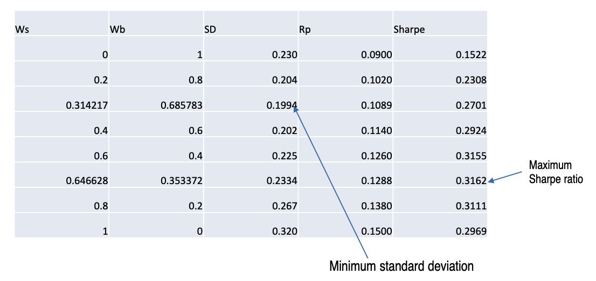

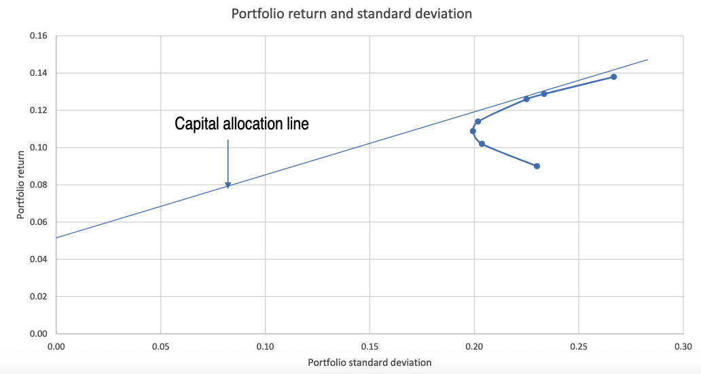

`最左侧点：最小风险点；切点：夏普比率最小点`

### Return of the combined portfolio

$$
E(r_c)=(I-y)r_f+yE(r_P)
$$

where: 

- $y$ = proportion invested in the risky portfolio
- $r_f$ = risk-free rate of return
- $E_{rp}$ = expected return of risky portfolio

## Linear Regression (Univariate)

Test for statistical significance

1. F-Test –Model validity test
2. T- test- Statistical Significance of the coefficients
3. R2  - Statistical significance of the coefficients
4. Error term - Residual analysis

### Model Validity Test (F-Test)

Null Hypothesis H0: Model is Not Valid

Alternative Hypothesis Ha: Model is valid

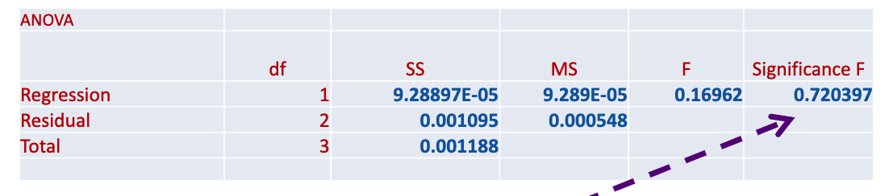

Calculated sig value = 0.720397>0.05
We do not reject Ho. Model is not valid

### Model Validity - R Square

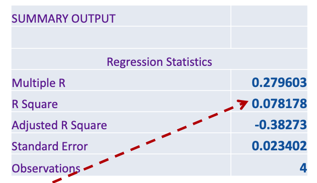
