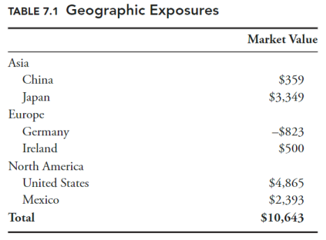

# Session 6: Risk Attribution 

## Learning Session

- Risk-Factor analysis 
- Incremental VaR (Value at Risk) 
- Risk-adjusted performance 
- Absolute risk attribution 

## Risk Attribution

- Risk attribution`归因` describes how various positions and groups of positions contribute to the overall risk of a portfolio. 
- Risk attribution is useful in summarizing the contents of a portfolio, and for managing risk in a portfolio. 

## **Risk-**Factor Analysis

- Attempts to identify and measure common sources of risk within large, complex portfolios. 
- The underlying sources of risks are called ‘factors’. 
- Factors can include: 
  - Equity market risk 
  - Sector risk
  - Country risk
  - Interest rate risk 
  - Inflation risk 
  - Style risk
- Minimize certain factor exposures by assigning limits based on the objectives. 

### Risk Taxonomy `分类` (an approach to factor analysis)

- Each security is assigned to just one factor. 
- Add the total exposure 

Example: measuring country exposure

- Each security is assigned to a specific country, e.g. US, China, France and so on. 
- Add up the exposures (market values) to portfolio-level exposure. 

### Risk-Factor Analysis (Weakness)

- Classification is **binary** – the stock is either in the US or China. 
- But, what if that company is headquartered in Germany, has all of its manufacturing capacity in China, sells its products to North America, and has listed shares on the London Stock Exchange? 
- Solution – statistical approaches to factor analysis 

One approach is to associate each factor with an index. Then, to use that index in regression analysis to measure a portfolio’s exposure to that factor. 

Systematic and idiosyncratic risk
$$
\sigma^2_P=\beta^2\sigma_{\mathit{index}}^2+\sigma_E^2
$$
where: 

- $\sigma^2_P$ : variance of the portfolio
- $\beta^2\sigma_{\mathit{index}}^2$ : systematic risk
- $\sigma_E^2$ : idiosyncratic risk

If beta, variance of the portfolio and variance of the market are 1.2, 0.3, and 0. 2 respectively, what is the systematic and idiosyncratic risk of the portfolio?

- Systematic risk =1.2^2*0.2 =0.288
- Idiosyncratic risk = 0.3-0.288 = 0.012

Questions

- Is this portfolio well-diversified? 
  - 0.012/0.3=4%, Yes
- How much of the variation of the portfolio return is explained by the market index? 
  - 96%

## Incremental VaR

- Incremental VaR (iVaR) quantifies the ==impact of a position or sub-portfolio== on the total value at risk (VaR). 
- The first term on the right shows the percentage change in position.
- iVaR is additive`可加的` – the sum of iVaRs in a portfolio are equal to the total VaR of the portfolio. 

> **Example**
>
> You are managing the risk for a portfolio with three strategies, A, B, and C. Strategy B has four positions. You had calculated the total VaR and iVaR for all of the positions and strategies, but some of the values were accidentally deleted. All of the iVaRs are relative to the total portfolio VaR of $1,400. This is what you have left: 
>
> 
>
> Position C = \$1,400 - \$400 - \$700 = 300
> Position 3 = \$700 - \$300- (-\$200) - \$100 = $500

## Risk-Adjusted Performance

### Sharpe Ratio

For a security, with expected return $R_i$, and the standard deviation $\sigma_i$, given the risk-free rate, $R_{rf}$, the Sharpe ratio is:
$$
S_i=\dfrac{R_i-R_{rf}}{\sigma_i}
$$

- Sharpe ratio is immune to leverage. 
- Given we can borrow and lend at risk-free rate, we can increase / decrease the standard deviation of the portfolio and Sharpe ratio can stay constant. 
- For a given level of risk, higher Sharpe ratio will provide a higher expected return. 
- Rational investors will seek to maximize the Sharpe ratio. 

> **Example** 
>
> You are interested in creating a levered version of an ETF. The ETF has a Sharpe ratio of 0.80 and an annual return standard deviation of 20%. The risk-free rate is 2%. Assuming you can borrow at the risk-free rate, what would the Sharpe ratio and expected return be for a 3× levered version of the ETF? 
>
> Return of the current portfolio can be calculated by substituting given figures in the equation for the Sharpe ratio as follows: 
> $$
> 0.8= (R_P-0.02)/0.20\quad\Rightarrow\quad R_P=0.18
> $$
>
> - To achieve a 3\*levered portfolio, you need to borrow two times your own capital.
> - Return of levered portfolio = 0.18\*3-0.02\*2 = 0.50
> - Standard deviation of the levered portfolio =0.20\*3 =0.60 
> - Sharpe ratio of the 3\*levered portfolio = (0.50-0.02)/0.6 = 0.80
> - The above calculations show that the Sharpe ratio is immune to leverage. 

If you have a portfolio and you want to add a security, should you choose the security with the highest Sharpe ratio? 
Not necessarily!

- Choose a security that will maximise the Sharpe ratio of new portfolio.
- The one with the highest incremental Sharpe ratio
- Might be the one with the lowest correlation with other stocks in the portfolio. 

### Incremental Sharpe Ratio

$$
S_i^*=S_i-\rho S_P
$$

Where: 

- $S_i^*$: the increamental Sharpe ratio
- $S_i$: the sharpe ratio of the security i
- $S_p$: the sharpe ratio of existing portfolio
- $\rho$: the correlation between thir returns

> Example 
>
> A hedge fund is considering hiring two different portfolio managers, Alice and Bob. The fund’s Sharpe ratio is currently believed to be 1.00. Based on historical data, you believe that Alice has a Sharpe ratio of 0.80 and is 30% correlated with the fund’s existing portfolio. Bob has a Sharpe ratio of 1.10 and is 90%correlated with the existing portfolio. Calculate the incremental Sharpe ratio for both managers. Assuming these values are correct which manager would improve the fund’s overall Sharpe ratio the most? 
>
> Incremental Sharpe ratio 
>
> - Alice = 0.80 - 0.30\*1.00 = 0.50 
> - Bob = 1.10 - 0.90\*1.00 = 0.20 

## Absolute Risk Attribution

Absolute risk attribution: Separating contribution of each security in a portfolio to total variance of the portfolio 

