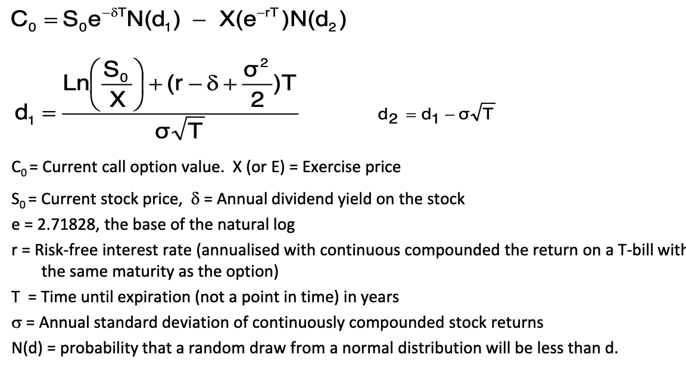
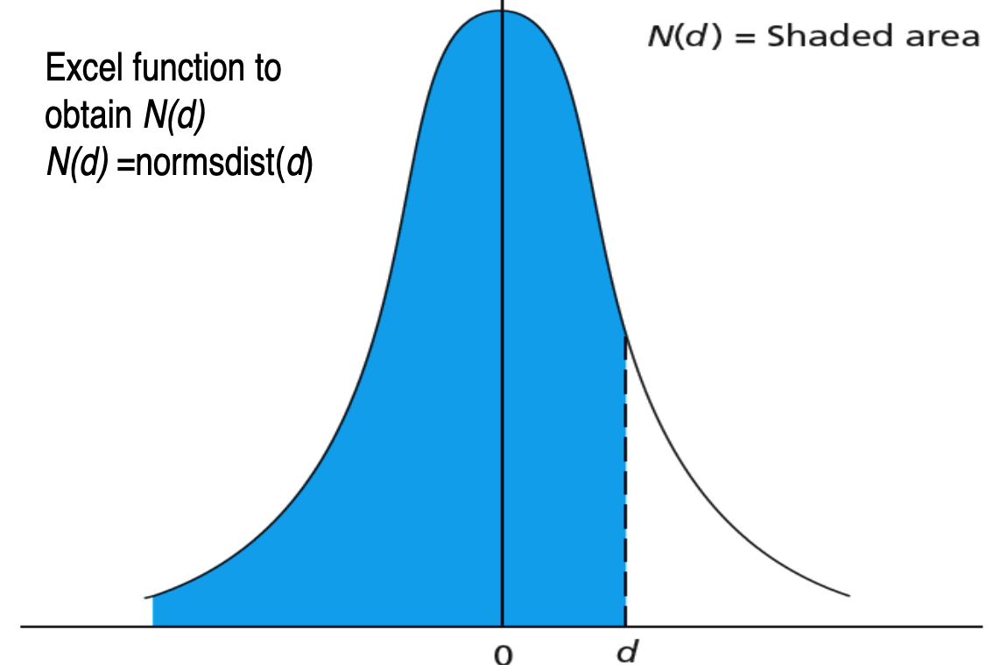
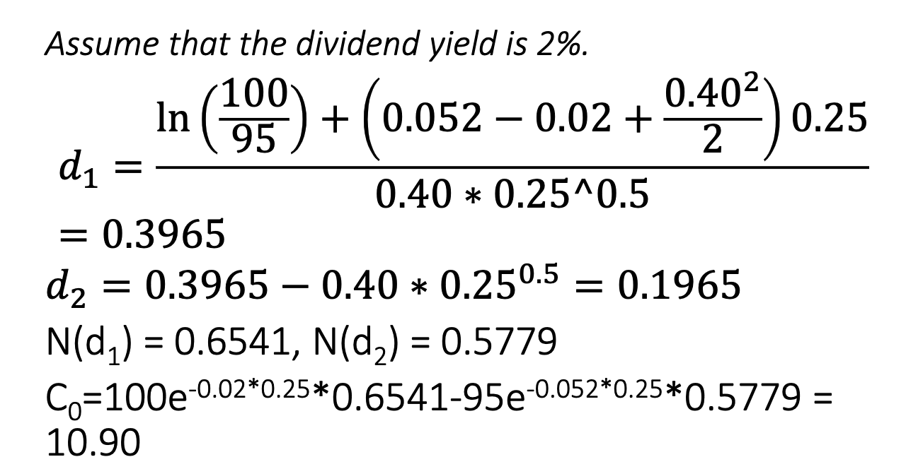

# Session 8: Derivative Instruments and Risk  Management

• Risk Management through hedging • Forward Contracts • Future Contracts • Options • Black-Scholes Option Pricing Model 

## Risk Management through Hedging

Derivatives serve a valuable purpose in providing a means of managing financial risk.

Some financial derivative instruments: 
1. Options 
2. Forward Contracts 
3. Future Contracts

## Types of Traders

- Derivatives markets attract many different types of traders and has a great deal of liquidity. 
- When an investor wants to take one side of a contract, there is usually no problem in finding someone who is prepared to take the other side. 
- Three broad categories of traders can be identified:
  1. Hedgers: Use ==derivatives==`衍生品` to reduce risk that they face from potential future movements in a market variables. 
  2. Speculators`投机`: Use them to ==bet== on the future direction of market variables. 
  3. Arbitrageurs: ==Take offsetting positions== `对冲` in two or more instruments to lock in a profit (involves locking in a riskless profit by simultaneously entering into transection in two or more markets).

### Arbitrageurs – an example

Let us consider a stock that is traded on both the London  stock exchange and New York stock exchange. 

An arbitrageur could simultaneously buy 100 shares in New  York (stock price US\$200) and sell in London (₤100) when the  exchange rate is \$2.0300 per pound and obtain the risk free  profit of 100 x {(\$2.03 x100) - \$200} =\$300 in the absence of  transaction costs. 

Buy from London and sell in New York.

## Trading Positions

Long

- Buying or holding any asset (stock, bond, commodity, currency, or options contracts).
- Expectations – the value or price will increase in the future – a bullish view. 

Short 

- Selling any asset (stock, bond, commodity, currency, or options contracts).
- Expectations – the value or price will decrease in the future – a bearish view. 

## Forward Contract

A contract that gives a buyer and seller an obligation to trade a certain asset (underlying asset) at a given price (forward price) on a future date (maturity date).

> **Example**
>
> Quotes on the exchange rate between the British Pound (GBP) and the US dollar on September 2, 2019 - GBP/USD
>
> |                 | BID (BUY) | Offer (SELL) |
> | --------------- | --------- | ------------ |
> | Spot            | 1.2062    | 1.207        |
> | 1-month forward | 1.2079    | 1.2087       |
> | 3-month forward | 1.2105    | 1.2113       |
> | 6-moth forward  | 1.2147    | 1.2155       |
>
> Spot rate indicates that the bank is prepared to buy 1 GBP (Sterling) in the spot market (i.e, for virtually immediate delivery) for 1.2062 USD and sell 1 GBP in the spot market for 1.2070 USD 
>
> Forward contracts can be used to hedge foreign currency
>
> 
>- September, 2 2019, the treasurer of a US corporation knows that the corporation will pay £1 million in six (6) month times March 2, 2020. 
>- To hedge against exchange rate move, the treasurer can agree to buy £1 million six month (6) forward at an exchange rate of 1.2155 by trading with bank.

## Futures Contract

- Similar to forward contracts, but are ==standardised== contracts traded on an exchange, such as Australian Securities Exchange. 
- All elements of the contract are determined by the exchange except the futures price, which is set by the parties, entering into the contract. 
- An obligation, but can be discontinued (‘closed out’`平仓` or ‘reserved’) at any time through an offsetting transaction on the exchange. You can exit on September 15 by selling the same contract. 
- Guaranteed against default by means of a daily settling of gains and losses (mark-to-market`盯市制度`). 

A futures contract on gold will have features (1) and (2)  but not (3) when compared to a forward contract. 
1. The forward price ($910) is decided now (1 March) but the transaction is to occur on a nominated future date (1 April) 
2. The details of commodity, which is the subject of the contract, are spell out (in this case one ounce of Gold) 
3. However, feature (3) is not true of a futures contract. A future contract is ==not a personalized== agreement.

## A Comparison of Forward and Futures Contracts

| Forward                                               | Futures                                          |
| ----------------------------------------------------- | ------------------------------------------------ |
| Private  contract between two parties                 | Traded on an Exchange                            |
| Not Standardized                                      | Standardized                                     |
| Usually one specific delivery date                    | Range of delivery date                           |
| Settled at end of contract                            | Settled daily                                    |
| Delivery or final cash settlement usually  take place | Contract is usually closed out prior to maturity |
| Some credit risk                                      | Virtually no credit risk                         |
| No margin                                             | Margin required                                  |
| Little regulation                                     | Regulated                                        |

## Options

An option is a contract between two parties- a buyer and a seller- that gives the buyer the ==right==, but not the obligation, to ==buy or sell something== at a ==later date== ==a price agreed upon today==.

**A Call Option**

- An option in which the buyer has the ==right but not the obligation== to buy an asset (such as share) at a specified exercise price within a specified time period.

**A Put Option**

- Right to sell an underlying asset at a fixed (strike) price, regardless of the share’s current market price.

**Exercise (or strike) price**

- The price at which an option holder can buy or sell the underlying security.

**Option can be classified into:**  

1. ==European Option== can be exercised ==at maturity only==. 
1. ==American Option== can be exercised ==at any time, before or at maturity==. 

> **An Example (Call)**
>
> - On 9 March 2020, the closing price of the “November 9.00” series of call options on the shares of XYZ was 35 cents. 
>   - Here the “November” refers to the month in which the call expires. 
>   - The figure ‘9.00’ indicates an exercise (or strike) price of \$9.00. 
>   - 35 cents is the price of the call options. 
> 
> - The closing price of XYZ share is on the same date was \$8.50. 
>- Each option contract covers 1000 shares.
> 
>Therefore, the call buyer has paid 1000 x 0.35= \$350 to obtain the right to buy 1000 XYZ shares at any time between 9th March, 2020 to 28th November, 2020, at a predetermined price of \$9 per share.

- The value of call when it expires depends on ==whether the share price at that time is greater than or less than the exercise price==. 
- If the share price at expiry of the call exceeds the exercise price, the call is worth the difference between the two (‘==in the money==’). 
- If the share price at that time is less than the exercise price, the call is worth zero (‘==out of the money==’). 

> **An Example (Put)** 
>
> On 9 March 2020 the closing price of the ‘July 11.00’ series of put options on the shares of the NAB was 42 cents. The closing price of NAB shares on the same date was \$11.50. 
> - The expiry date is 25 July 2020 
> - The exercise price is \$11.00 
> - Price of the put is \$0.42 per share 
> - The put buyer has paid $1000 \times \$0.42 = \$420$ to obtain the right to sell 1000 NAB shares at any time between 9th March 2020 and 25 July 2020 at a predetermined price of \$11.00 per share.
>

### Option Strategies

There are many option strategies. Three of the popular strategies are given below: 

- Protective put `保护性看跌期权`
- Covered call `保护性看涨期权`
- Collar `利率上下限期权（领子期权）`

### Black–Scholes option valuation of European call options

| Citeris paribus, if this  variable is greater | …the value of call option is |
| --------------------------------------------- | ---------------------------- |
| Stock price, S0                               | Greater                      |
| Exercise price, X                             | Lower                        |
| Volatility, σ                                 | Greater                      |
| Time to expiration, T                         | Greater                      |
| Interest rate, r                              | Greater                      |
| Dividend yield, δ                             | Lower                        |

> **Example** 
>
>
> - Use the following data to calculate the price of call option and a put option 
> - Current share price = $100 
> - Exercise price = $95 
> - Maturity = 3 months 
> - Risk-free rate of return = 5.2% per annum 
> - Dividend yield = 2% per annuam 
>
> 

### Put-call parity

- This is an equation representing the proper relationship between put and call prices. The equation is as follows:

- P0=C0+PV(X)-S0+PV(dividends)

- Therefore, using the above equation, the value of a put option is

- P0=10.90+95e^-0.0520.25-100e^-0.02*0.25=5.17

#### Violation of put–call parity

- Suppose the above put is actually priced at \$4.00. How could a trader take advantage of this? 
- Because the actual price is below the price obtained from the put-call parity equation the put option is underpriced. Therefore, buy the undervalued put and short the call. 

By using this strategy, we can make a profit of \$1.17 (\$5.17-\$4.00) per put. The proof is as follows:

| Action           | Cash flow |
| ---------------- | --------- |
| Buy stock        | ($99.50)  |
| Borrow PV of $95 | $93.77    |
| Buy put          | ($4.00)   |
| Sell call        | $10.90    |
|                  | $1.17     |

### Hedge ratio (delta) `对冲比例`

According to the calculations in slide 26 N(d1) = 0.6541. 

- This means that when the ==share price increases by \$1, the call option value will increase by \$0.65==. 
- Therefore, for every call option written, 0.65 shares would be needed to hedge the investor’s portfolio. 
- If you have ==written 100 call options==, you ==need 65 shares to eliminate the risk or hedge==

Suppose the current share price is \$100. If this price increases by \$1, your gain from stocks would be \$65 whereas your loss from options would be also \$65 (100 options*0.65)

### **Option **elasticity`弹性`

- In the example on slide 26, the call price is \$10.90. If the share price increases by \$1, calculate the elasticity of the option. 
- Answer will be provided during the session

