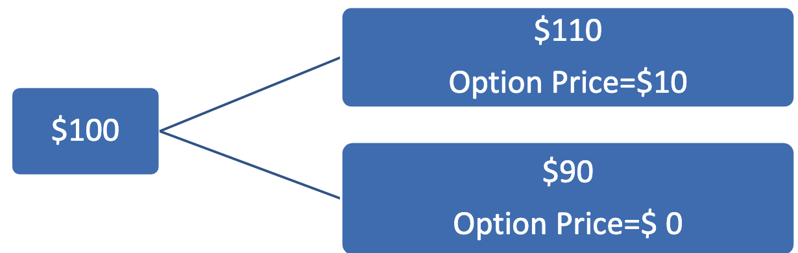
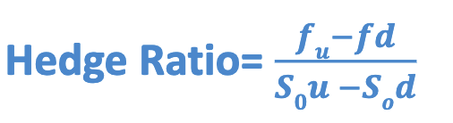
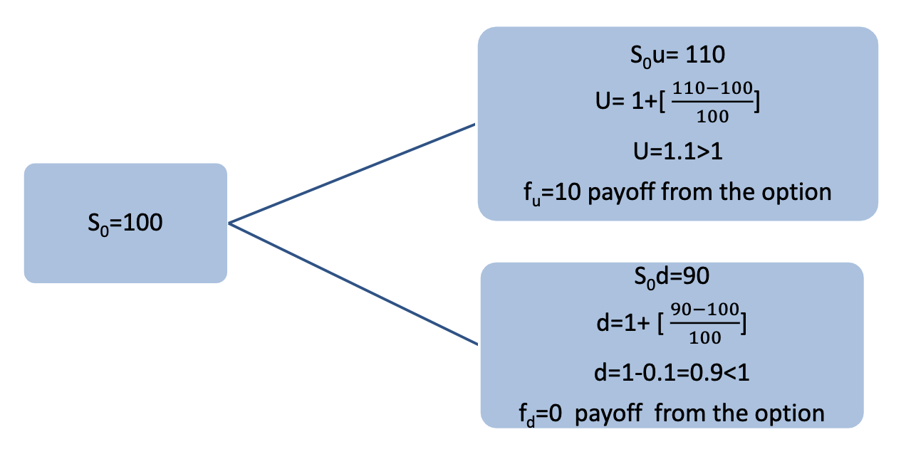

# Session 9 Options Pricing and Stock Market

## Learning Objectives

- The Markov Property 
- The Model of the Behaviour of Stock Price 
- Lognormal distribution and Forecasting share prices 
- A Binomial Option Pricing (Introduction)

## **The Behavior of Stock Price** 

A variable whose value changes over time in an uncertain way is said to follow a *stochastic process*`随机过程`. 

The Markov Property `马尔科夫性质`

> 当一个随机过程在给定现在状态及所有过去状态情况下，其未来状态的条件概率分布仅依赖于当前状态；换句话说，在给定现在状态时，它==与过去状态（即该过程的历史路径）是条件独立的==，那么此随机过程即具有马尔可夫性质。具有马尔可夫性质的过程通常称之为马尔可夫过程。
>
> [马尔科夫性质 - 维基百科](https://zh.m.wikipedia.org/zh-hans/%E9%A9%AC%E5%B0%94%E5%8F%AF%E5%A4%AB%E6%80%A7%E8%B4%A8)

- A Markov process is a particular type of stochastic process where only the ==present value== of a variable is ==relevant for predicting future==.`instead of historical value` 
- The past history of the variable and the way that the present has emerged from the past are irrelevant`无关`. 
- The Markov property implies that the probability distribution of the price at any particular future time is not dependent on the particular path followed by the price in the past. 

### **Stock Prices and a Markov Process**

- The Markov property of stock prices is consistent with the weak form of market efficiency. `市场至少弱有效时，股价具有马尔科夫性质`
- This states that the present price of a stock impounds all the information contained in a record of past prices. 
- If the weak form of market efficiency were not true, technical analysts could make above-average returns by interpreting charts of the past history of stock prices. There is very little evidence that they are, in fact, able to do this.

## Point Estimate of Stock Price

According to the properties of the lognormal distribution, we can show that the expected value of $S_T$ after $T$ years is

$$
E(S_T)=S_0e^{\mu T}\\[1ex]
\mathit{Var}(S_T)=S_0^2e^{2\mu T}(e^{\sigma^2 T}-1)
$$
Where: 

- $\mu$ (or $E(R)$): expected return per annum 
- $\sigma$ (or $\mathit{Std}(R)$): std of expected return per annum
- $S_0$: current share price
- $T$: time in year

> **Example** 
>
> Consider a stock where the current price is \$20, the expected return is 20% per annum, and the volatility ($\sigma^2$) is 40% per annum. The expected stock price in one year, $E(S_T)$, and the variance of the stock price in one year, $\mathit{Var} (S_T)$, are given by
> $$
> \begin{align}
> E(S_T)&=20\times e^{0.20\times1}=\$24.43\\[1ex]
> \mathit{Var}(S_T)=\sigma^2_{S_T}&=20^2\times e^{2\times0.20\times1}\times(e^{0.40\times1}-1)=327.49\\[1ex]
> \mathit{Std}(S_T)=\sigma_{S_T}&=\sqrt{327.49}=\$18.10
> \end{align}
> $$
> Consider a stock with initial price of \$40, and expected return of 16% per annum, and a volatility ($\sigma^2$) of 20% per annum
>
> The probability distribution of  the stock price $S_T$, in six month ‘s time is given by 
> $$
> \ln S_T \sim N [\ln S_0+(\mu-\dfrac{\sigma^2}2)\cdot{T},\ \sigma\sqrt T]
> $$
> So, 
> $$
> \ln S_T \sim N \left(\ln 40+\bigl(0.16-\dfrac{0.20}2\bigr)\times{0.5},\ 0.45\times\sqrt{0.5}\right)\\[1ex]
> \ln S_T \sim N(3.72,\ 0.32)
> $$
> There is a 95% probability that a normal distributed variable has a value within 1.96 standard deviation of its mean. Hence, with 95% confidence is 
> $$
> &e^{3.72-1.96\times0.32}<S_T<e^{3.72+1.96\times0.32}\\[1ex]
> \Rightarrow&\quad22.02<S_T<77.25
> $$

## Volatility per Day

$$
\sigma_{\mathrm{day}}=\dfrac{\sigma_{\text{per year}}}{\sqrt{T}}
$$

Where $T$: Number of Trading day per annum (252 days)

## Binomial Models and Option Price

- Binomial models `二项式模型` assume that the underlying random variable (the price of the security underlying the option) has a binomial distribution. 
- It is based on the assumption of no arbitrage `无套利`. 

  - *arbitrage is the practice of taking advantage of a price difference between two or more markets* 

- The binomial model assume the probability of creating a risk-free portfolio by hedging a long-position in the underlying asset with a short position in a number of fairly priced call options on that asset.

Assume that the current stock Price is \$100 Next month the price of the stock can go up to \$110 or down to \$90.

We are interested in valuing a European call option to buy a stock for $100 (strike price or exercise price) in 3 months time.

Consider a portfolio consisting of a long position in n shares of stock and short position in one (1) call option `买入n股，同时卖出一份看涨期权`
- Price increase
  - If the stock price moves from \$100 to \$110, 
  - The value of the share is \$110n (after 3 months) 
  - The value of the option is \$10 (after 3 months) 
  - Total value of the portfolio is \$110n -\$10 
- Price decrease
  - If the stock price moves from \$100 to \$90 , 
  - the value of the share is 90n 
  - The value of the option is \$0 
  - Total value of the portfolio is \$90n 
- The portfolio is ==riskless== if the value of n is chosen so that the ==final value of the portfolio is the same for both situations==. This means that.. 
  - 110n -10 = 90n
  - n = 10/20 = 0.5 
  
- A riskless Portfolio is therefore 
  - **Long : 0.5 Shares** 
  - **Short : 1 Option**

In this portfolio: 

- If the stock price move up to $110, the value of portfolio is: 

  - 110 x 0.5 - 10 = 45 

- If the stock price moves down to $90, the value of portfolio is: 

  - 90 x 0.5= 45 

- Regardless of whether the stock price moves up or down, the value of portfolio is always 45 at the end of the life of the option (3-months).

- Riskless portfolio in the ==absence of arbitrage opportunities==, ==earn the risk free rate of interest==. 

  - Suppose that in this case the risk free rate is 12% per annum

  - Today Portfolio value is `45元以12%无风险利率贴现`
    $$
    \begin{align}
    \text{Portfolio Value}\cdot e^{-rt}&=45\times e^{-0.12\times 3/12}\\[1ex]
    &=\$43.65
    \end{align}
    $$

- The value of the stock price today is known to be $100

  - Suppose the option price is denoted by f

  - The value of the portfolio today is 

    $$
    &\text{Today's Portfolio Value} = \text{Value of Stock} - \text{Value of Option}\\[2ex]
    \Rightarrow&43.65=50-f
    $$
    So, option price (f) = $6.35

  - This shows that in the absence of arbitrage opportunities, the current value of the option must be $6.35

### Generalisation

Let

- $S_0$, $S_u$, $S_d$: stock price
- $f$: current option price
- $T$: option period
- $f_u$, $f_d$: the option price at the end
- $n$: the number of stock in portfolio
- $u$, $d$: the situation what the price of stock goes up / down
- $P$: the value of risk less portfolio

If the stock price increase: 

- $f_u=S_u-S_0$
- $P_u=nS_u-f_u$

If the stock price decrease: 

- $f_d=0$
- $P_d=nS_d-f_d$

To build a risk less portfolio, the value of the portfolio at the end will be the same. 
$$
&P_u=P_d\\[1ex]
\Rightarrow&nS_u-f_u=nS_d-f_d\\[1ex]
\Rightarrow&n=\dfrac{f_u-f_d}{S_u-S_d}
$$
Assume the risk free rate is $r$ (notice $P_T=P_u=P_d$), 
$$
P_0=P_T\cdot e^{-rT}
$$
After we have $n$ and $S_0$, we can calculate $f$ by: 
$$
nS_0-f=P_T
$$

## Hedge Ratio

- It is the ratio of ==change in the call option price to the change in the stock price==. 
- It measures the **==change in option values== ==per $1 dollar change in stock price==**. 
- This is the ‘Delta” of the call option. 

## Call Option Price

The portfolio is riskless, for there to be no arbitrage opportunities, it must earn the risk-free interest rate `右侧是二项分布的期权价格，左侧是贴现因子`
$$
f=e^{-rt}[pf_u+(1-p)f_d]\\[1ex]
p=\dfrac{e^{rt}-d}{u-d}
$$

> Example: 
>
> - Current stock price = $S_0=100$
> - Current Option Price: $f$
> - Option Period: $T= 3$ months
>
> During the life period of the option the stock price can either move:
>
> - Up from $S_0 =100$ to new level $uS_0$ , where $u >1$
>   - If the stock price moves up to $uS_0=110$, payoff from the option is $f_u=10$
> - Or down from $S_0$ to a new level $dS_0$, where $d<1$
>   - If the stock price moves down to $dS_0 =90$, payoff from the option is $f_d=0$
>
> Suppose in this case 
>
> - the risk free rate is 12% per annum
> - Strike Price is 100
>
> 
>
> Since 
> $$
> f=e^{-rt}[pf_u+(1-p)f_d]\\[1ex]
> p=\dfrac{e^{rt}-d}{u-d}
> $$
> So option price is 
> $$
> p=\dfrac{e^{0.12\times\frac3{12}}-0.9}{0.2}=0.6522724\\[1ex]
> f=e^{-0.12\times\frac3{12}}[0.6522724\times10+(1-0.6522724)\times0]=6.327
> $$
